# CivicHub

**One platform for residents, municipal staff and field guards.**

CivicHub is a municipal services web app themed around Tel Aviv-Yafo. Residents pay bills, report problems and appeal fines; staff review disputes and dispatch maintenance; field guards issue citations from the street. It is fully responsive, from desktop down to a phone.

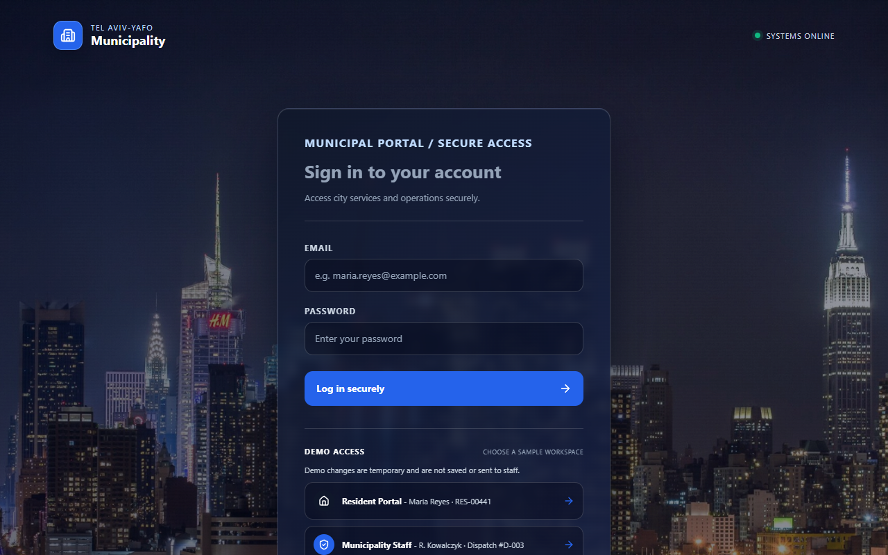

## Portals and features

### Resident portal
- Dashboard with account status, balance, active fines, open requests, utility usage chart and citations
- Property overview
- My services: report a problem, view fines and citations, file appeals
- Billing: invoices, PDF receipts and a payment checkout

### Staff portal
- Citation disputes: review, approve or reject appeals
- Billing ledger across all accounts
- Resident requests inbox: review, assign or reject
- Maintenance dispatch: kanban board (Unassigned / Dispatched / In Progress / Completed), assign teams, create tickets

### Field Guard portal
- Overview of the shift and assigned reports
- Issue parking citations with automatic fine calculation
- Reports filtered by status and priority
- Issue history

### Everywhere
- Light and dark theme
- Notification bell (Novu)
- Mobile-first layout: hamburger drawer, sticky headers, stacked card tables, two-up stat tiles, and a tabbed maintenance board on small screens

## Screenshots

### Desktop

| Resident dashboard | Resident billing |
| :---: | :---: |
| 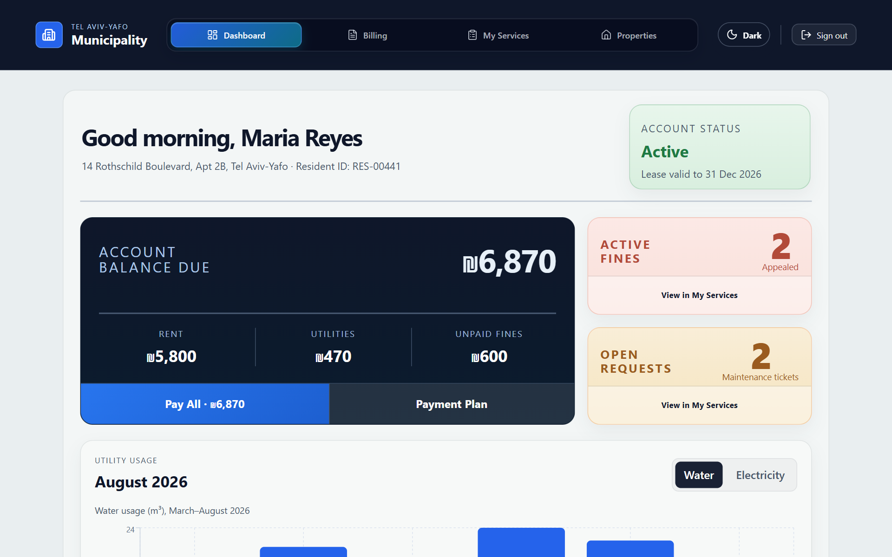 | 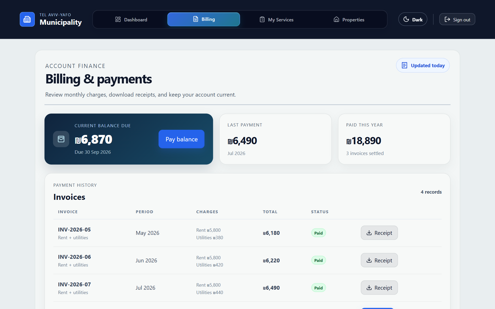 |

| Staff: citation disputes | Staff: maintenance dispatch |
| :---: | :---: |
| 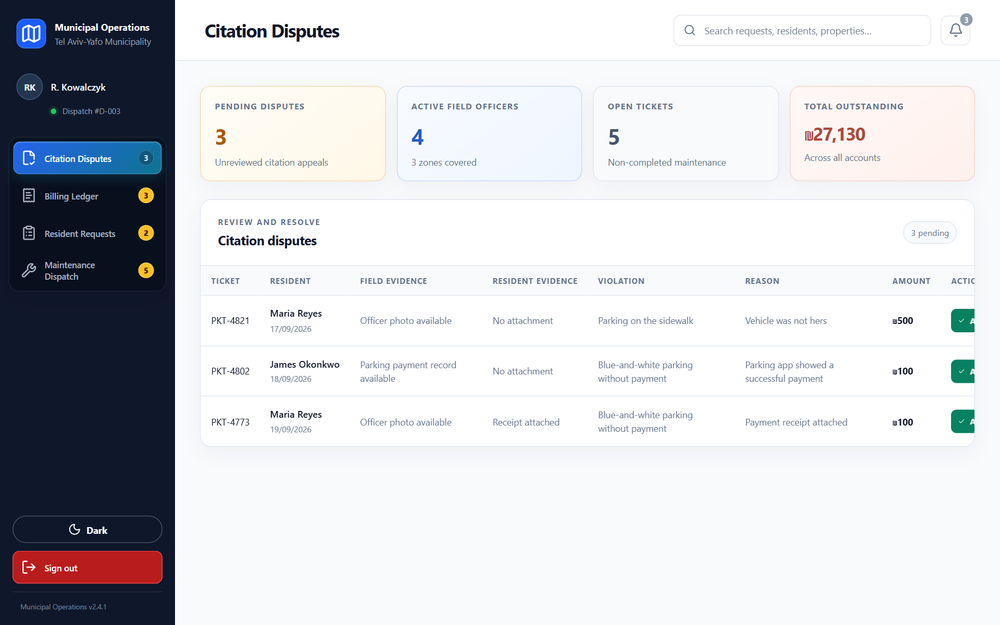 | 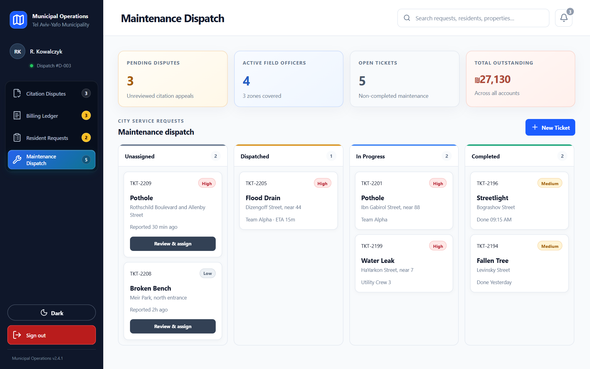 |

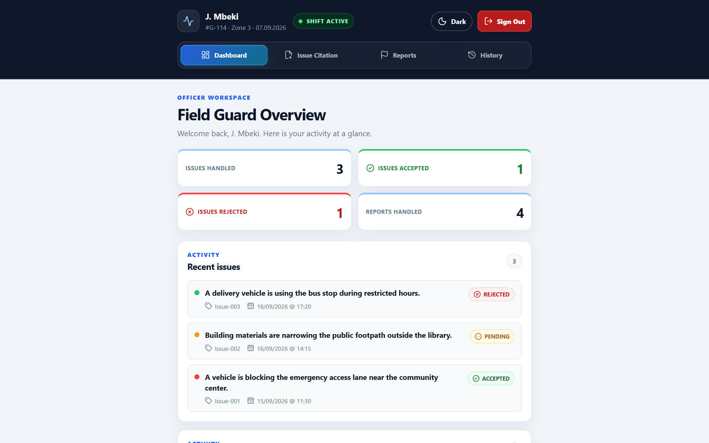

### Mobile

| Resident dashboard | Navigation drawer | Billing | Maintenance dispatch | Field Guard |
| :---: | :---: | :---: | :---: | :---: |
| 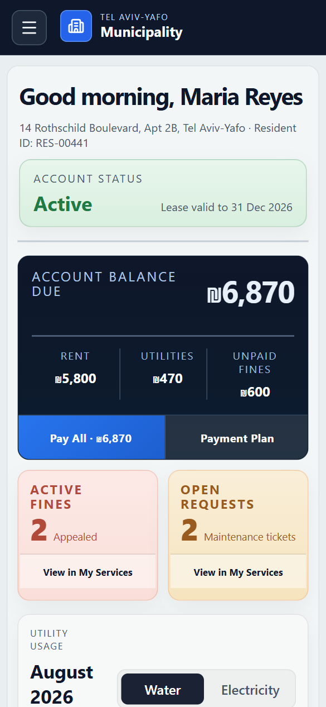 | 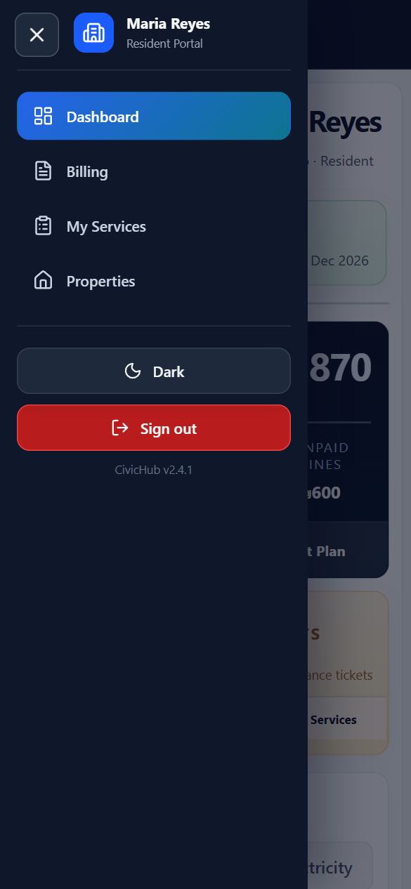 | 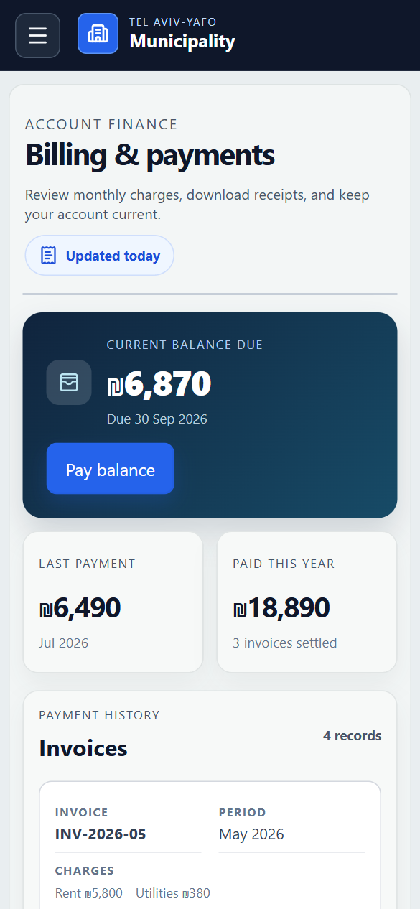 | 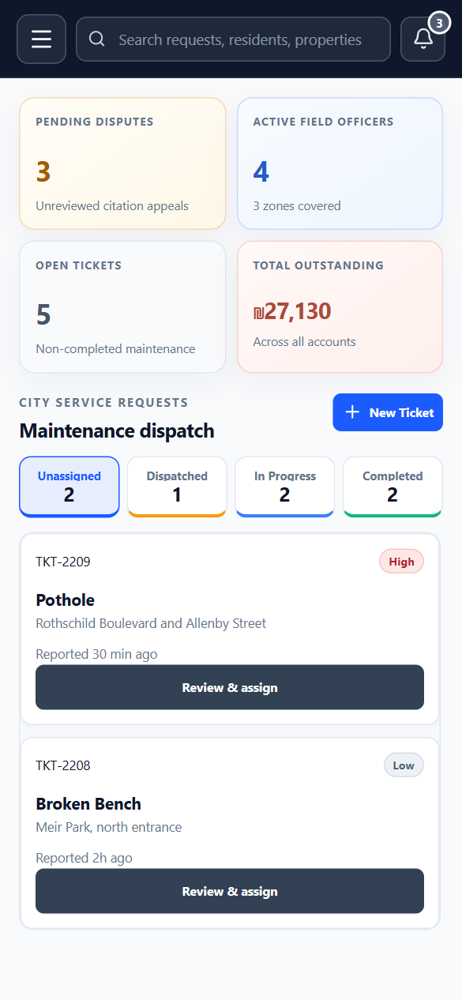 | 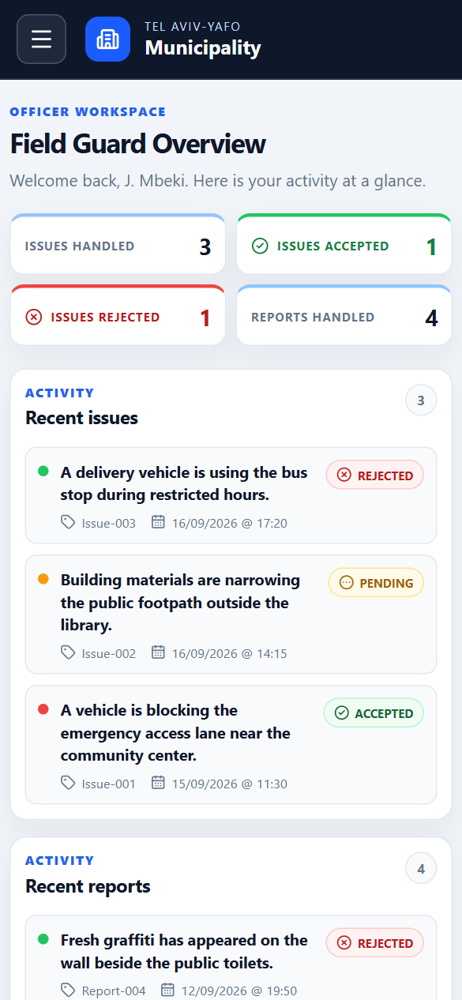 |

## Tech stack

- [React 19](https://react.dev) + [TypeScript](https://www.typescriptlang.org)
- [Vite](https://vite.dev) and [React Router 7](https://reactrouter.com)
- [Recharts](https://recharts.org) for charts
- [lucide-react](https://lucide.dev) for icons
- [jsPDF](https://github.com/parallax/jsPDF) + autotable for PDF receipts
- [React-Toastify](https://fkhadra.github.io/react-toastify/) for toasts
- [Novu](https://novu.co) for in-app notifications
- ESLint for linting

## Getting started

Requires Node.js 20+.

```bash
npm install
npm run dev
```

Open the URL Vite prints (usually http://localhost:5173).

| Script | Purpose |
| --- | --- |
| `npm run dev` | Start the dev server |
| `npm run build` | Type-check and build for production |
| `npm run preview` | Preview the production build |
| `npm run lint` | Run ESLint |

### Demo access

The login page offers one-click demo accounts for each portal (Resident, Municipality Staff and Field Guard). Portal data is static demo data, so no backend is needed to explore the UI. Real sign-in calls an auth API at `http://localhost:4000`, which is not part of this repository.

To enable notifications, set `VITE_NOVU_APPLICATION_IDENTIFIER` in a `.env` file.

## Project structure

```
src/
├── assets/         Backgrounds and README screenshots
├── components/     Resident, Staff, Field Guard, Login and shared components
├── contexts/       Theme, user and citation state
├── data/           Demo accounts and static portal data
├── helpers/        Formatting, PDF and field guard helpers
├── layouts/        Staff and Field Guard layouts
├── pages/          Route-level pages
└── styles/         CSS, including the shared mobile system
```

## Team

Helayel Hamayel and Mohamad Amer.
